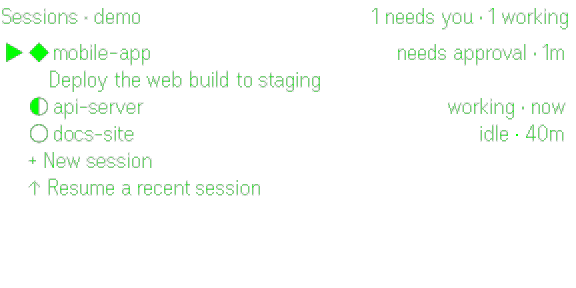

# GlanceCode

Drive your Claude Code and Codex sessions from Even Realities G2 glasses. See the
live transcript, approve tool calls, answer questions, and hold to talk. Everything
runs on your own computer.

<p>
  
  
</p>

GlanceCode is an independent project. It isn't affiliated with or endorsed by
Anthropic, OpenAI or Even Realities.

## How it works

Every session is ordinary Claude Code running inside tmux. A small hub on your
computer follows your sessions through Claude Code hooks and their transcript
files, and types into them through tmux. The glasses app talks only to that hub,
over your private Tailscale network.

```
Claude Code in tmux ──hooks──▶ hub (127.0.0.1)
        ▲      transcript ──▶ hub
        └──── tmux keys ◀──── hub ◀── tailscale serve (HTTPS) ◀── Even app ◀── G2
                               └─ whisper.cpp (local speech to text)
```

Claude Code itself is never replaced or modified, so your model, permission mode,
background tasks, Remote Control and `tmux attach` at your desk keep working.
There's only ever one Claude process per session, and the phone, the terminal and
the glasses all see the same conversation.

Codex works differently, and more directly. Codex runs an app server that its
terminal UI talks to, and the hub joins that server as one more client. Prompts,
approvals and answers go through Codex's own protocol, so nothing is typed into a
terminal and the terminal shows whatever the glasses do as it happens.

```
codex (terminal) ──▶ Codex app server ◀── hub ◀── tailscale serve ◀── Even app ◀── G2
```

## What you get on the glasses

- A list of every Claude Code and Codex session on your computer, with live state:
  working, idle, or waiting for you.
- The live transcript of any session: prompts, replies, progress notes and tool
  calls, pixel-wrapped for the G2 display.
- Approvals and questions with the exact options the session is offering. For
  Claude Code, keys are only pressed after that dialog is read back from the
  terminal. For Codex, the answer goes straight to Codex.
- Hold to talk. Words appear while you speak. Release to review, then tap to send.
- Start a new session in a recent project with either agent, or resume a past
  session.
- A menu to interrupt, compact, or switch the session's model without changing
  your default.

## Requirements

On your computer (macOS or Linux):

- Node 20 or newer
- [Claude Code](https://claude.com/claude-code), [Codex](https://github.com/openai/codex),
  or both, signed in. Codex support needs the Codex CLI
  (`npm install -g @openai/codex`) and turns on by itself when the hub finds it.
- tmux
- [Tailscale](https://tailscale.com), signed in, with HTTPS certificates turned on
  for your tailnet at [login.tailscale.com/admin/dns](https://login.tailscale.com/admin/dns)
- Optional, for voice: [whisper.cpp](https://github.com/ggml-org/whisper.cpp).
  It's free, open source and runs offline, so there's no API key or
  subscription. Without it, everything except hold to talk still works.

On macOS with Homebrew:

```bash
brew install tmux whisper-cpp
brew install --cask tailscale-app
```

On your phone:

- The Even Realities app, paired with your G2 glasses
- Tailscale for [iPhone](https://apps.apple.com/app/tailscale/id1470499037) or
  [Android](https://play.google.com/store/apps/details?id=com.tailscale.ipn),
  signed in to the same Tailscale account as your computer

GlanceCode is tested on iPhone. Android should work the same way but hasn't been
tested yet.

## Install

```bash
npm install -g @sousy/glancecode
glancecode setup
```

`setup` checks the requirements, adds the Claude Code hook, downloads the speech
model, starts the hub as a background service, serves it over HTTPS on your
`*.ts.net` name, and prints a pairing code.

Then install **GlanceCode** from Even Hub in the Even Realities app, open it, and
paste the pairing code on the phone screen. Before pairing, a tap on the glasses
starts a demo with sample sessions.

To let the glasses drive a session you start at your desk, start it inside tmux:

```bash
glancecode claude          # takes the same arguments as claude
alias claude='glancecode claude'   # optional, in your shell rc
```

Sessions started any other way still appear on the glasses, marked view only.

For Codex, start sessions through the hub's Codex server so the glasses can join
them:

```bash
glancecode codex           # takes the same arguments as codex, including resume
alias codex='glancecode codex'     # optional, in your shell rc
```

Plain `codex`, the Codex IDE extension and the Codex desktop app each run a
private server that other programs can't join, so their sessions don't show up
live. Past sessions from all of them do appear under Resume on the glasses.

## Using it

| Gesture | Session list | Session |
|---|---|---|
| Swipe | move | scroll, or move between options |
| Tap | open | choose the highlighted option, or jump to the latest |
| Hold | talk to the highlighted session | talk, or answer an open question; hold again to redo |
| Double-tap | exit | back |
| Tap then hold | menu | interrupt, jump to latest, switch model, compact |

At your desk:

| Command | What it does |
|---|---|
| `glancecode feed` | a readable live feed of every session |
| `glancecode attach [name]` | open a running session in this terminal |
| `glancecode ls` | list sessions |
| `glancecode doctor` | check every piece and say what to fix |
| `glancecode pair` | print the pairing code again |

Closing a terminal window only detaches from tmux. The session keeps running and
the glasses can still reach it.

## Security

- The hub listens on 127.0.0.1 only. Your phone reaches it through
  `tailscale serve`, so traffic stays inside your tailnet and is encrypted.
- Every request needs the pairing token. Anyone with that token and access to your
  tailnet can type into your sessions, so keep it private. To replace it, delete
  the `token` line in `~/.config/glancecode/config.json` and run
  `glancecode service restart`.
- The hook port accepts connections from 127.0.0.1 only.
- The Codex app server listens on a unix socket in `~/.config/glancecode`, which
  only your user account can open. It never listens on the network.
- Voice is transcribed on your computer. Audio isn't sent anywhere else.

See [SECURITY.md](SECURITY.md) to report a vulnerability and
[docs/privacy.md](docs/privacy.md) for what data goes where.

## Configuration

`~/.config/glancecode/config.json` is created on first run with mode 600.

| Key | Default | Purpose |
|---|---|---|
| `port` | 7717 | hub API on 127.0.0.1 |
| `httpsPort` | 7443 | HTTPS port on your `*.ts.net` name |
| `hookPort` | 7718 | hook intake on 127.0.0.1 |
| `claudeArgs` | `[]` | extra arguments for sessions started from the glasses |
| `sttVocabulary` | | words the speech model should expect |
| `ntfyTopic` | empty | optional phone push through ntfy when a session finishes or needs you |
| `bindTailscaleIP` | false | also listen on the raw Tailscale IP over plain HTTP, for development |
| `preventSleep` | true | macOS: keep the Mac awake while plugged in, so the glasses can reach it |
| `codex` | `"auto"` | follow Codex sessions when the Codex CLI is installed; `false` turns it off |
| `codexBin` | `codex` | the Codex command, or a full path to it |
| `defaultAgent` | `claude` | what New session starts on glasses app versions that don't ask |

## Limitations

- Even Hub apps only run while they're open on the glasses. To hear about a
  session while another app is open, set `ntfyTopic`. The Even app mirrors phone
  notifications to the glasses.
- The G2 display has one font weight, so markdown is shown as plain text.
- Claude Code sessions must run inside tmux for the glasses to type into them.
- Codex sessions must be started with `glancecode codex` to show up live.
- Switching a Codex session's model from the glasses applies from the next message
  you send from the glasses.

## Development

```bash
npm run build:app          # build the glasses app
npm test                   # hub and app tests
glancecode hub                # run the hub in the foreground
glancecode pair --dev         # sideload the hub-served app with a QR code
npm run pack:app           # bump the version and build the Even Hub store package
```

The simulator can drive the app without glasses:
`npx @evenrealities/evenhub-simulator --automation-port 9898 "http://127.0.0.1:5173/?demo"`.

## Credits

Ideas and lessons from [cc-g2](https://github.com/wmoto-ai/cc-g2) and
[claude-code-g2](https://github.com/sam-siavoshian/claude-code-g2), and Even
Realities' [templates](https://github.com/even-realities/evenhub-templates) and
pretext font metrics. All MIT licensed.

## License

[MIT](LICENSE)
